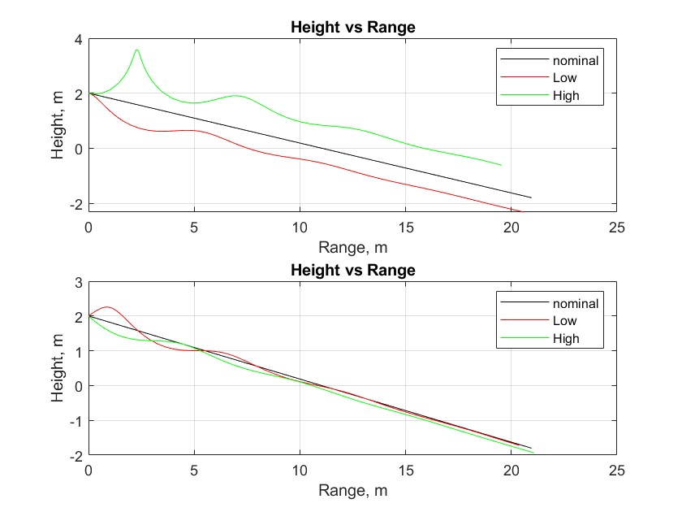
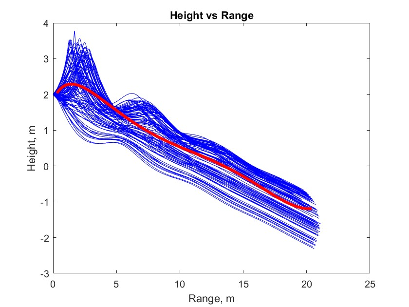
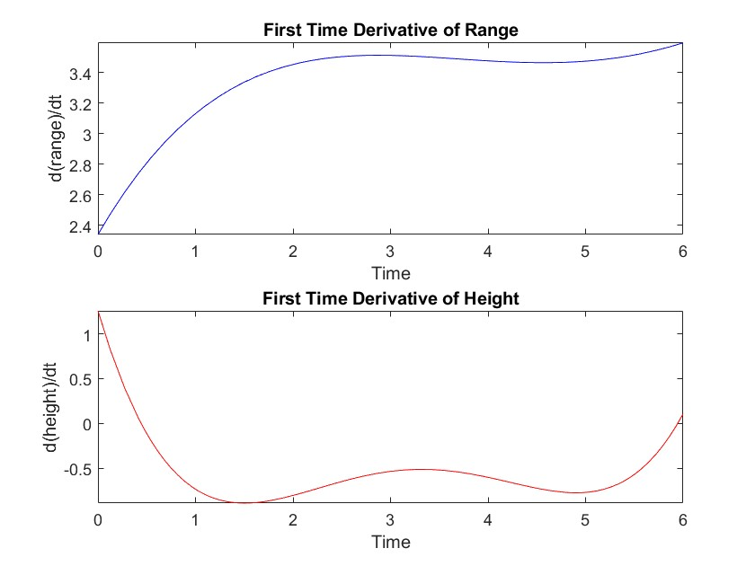
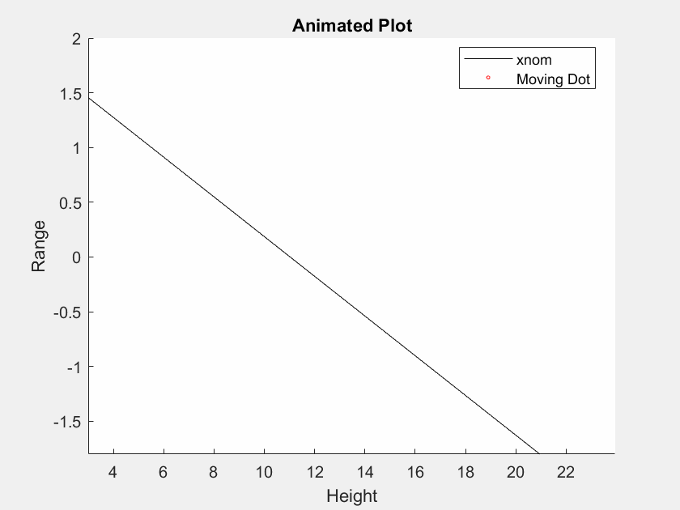

# Paper Airplane Numerical Study
  Final Project: AEM 3103 Spring 2024
  - By: Madhurima Das & Jocelyn Prewett

# Summary of Findings
  

## Variations Studied : Summary of Height Vs. Range Plots 
|          Graph Description         |  Line Color/Description |   Initial Velocity Value   | Initial Velocity Description |   Flight Path Angle Value  | Flight Path Angle Description |
|:----------------------------------:|:-----------------------:|:--------------------------:|:----------------------------:|:--------------------------:|:-----------------------------:|
| Single Parameter Variation Graph 1 | Black                   | 3.5494                     | Nominal Value                | -0.1794                    | Nominal Value                 |
| Single Parameter Variation Graph 1 | Red                     | 2                          | Min Value                    | -0.1794                    | Min Value                     |
| Single Parameter Variation Graph 1 | Green                   | 7.5                        | Max Value                    | -0.1794                    | Max Value                     |
| Single Parameter Variation Graph 2 | Black                   | 3.5494                     | Nominal Value                | -0.1794                    | Nominal Value                 |
| Single Parameter Variation Graph 2 | Red                     | 3.5494                     | Min Value                    | -0.5                       | Min Value                     |
| Single Parameter Variation Graph 2 | Green                   | 3.5494                     | Max Value                    | 0.4                        | Max Value                     |
| Monte Carlo Simulation             | Blue (100 Trajectories) | N/A                        | Random Values                | N/A                        | Random Values                 |
| Monte Carlo Simulation             | Red                     | Generated values by MATLAB | Avg of Random values         | Generated values by MATLAB | Avg of Random                 |
| Animated Plot                      | Black                   | 3.5494                     | Nominal Value                | -0.1794                    | Nominal Value                 |
| Animated Plot                      | Blue                    | 7.5                        | Given Value                  | 0.4                        | Given Value                   |
| Animated Plot                      | Red(dot)                | 7.5                        | Given Value                  | 0.4                        | Given Value                   |

<Show the variations studied in a table>
**Summary** 
	In this project, we analyzed the flight path of a paper airplane using equations of motion along varying flight path angle and initial velocity values. In the first part (Part A), height and range were observed while first varying initial vellocity and then varying flight path angle(Gamma) in a second plot. These plots show how making individual changes to the initial conditions of flight affect the flight path. In the second part (Part B), were were able to use a random number generator to plot 100 possible trajectories. Then an average curve-fit was found and plotted against these predictions to come up with an average prediction of flight path over varying conditions. The first derivative of Range vs time and the first derivative of Height vs time plots imply the change in the range and height over time from the fitted line thus showing the slope of the curve-fit line. Finally, the animated plot GIF shows the predicted flight path for the given conditions and the moving dot indicates the location of the paper airplane over a time period of 6 seconds. 

# Code Listing:
- [PaperPlane.m](https://github.com/madhurimadas3/AEM3103/blob/af7bd46c4f5ee8da65c25e1c3dd182f89c386a7f/PaperPlane.m)
	- Establishes Starting Variables
- [EqMotion.m](https://github.com/madhurimadas3/AEM3103/blob/827eb4b64bd9fb1772f3257a30072cc2b40c96f3/EqMotion.m)
	- Function for the equations of motions for the airplane
- [PartA.m](https://github.com/madhurimadas3/AEM3103/blob/827eb4b64bd9fb1772f3257a30072cc2b40c96f3/PartA.m)
	- Code for the first set of graphs showing Height vs. Range while varying first initial velocity and then gamma
- [PartB.m](https://github.com/madhurimadas3/AEM3103/blob/827eb4b64bd9fb1772f3257a30072cc2b40c96f3/PartB.m)
	- Code for the second set of graphs showing the variations of velocity and gamma with a (red) curve fit, then showing dR/dt over time and dH/dt over time.
- [Animation.m](https://github.com/madhurimadas3/AEM3103/blob/827eb4b64bd9fb1772f3257a30072cc2b40c96f3/Animation.m)
	- Code to create a GIF of V=7.5 m/s and gamma = 0.4 rad against the nominal line

  # Figures

  ## Fig. 1: Single Parameter Variation

Height vs. Range plots 
1. Height vs Range over varying initial velocities
2. Height vs Range over varying flight path angle(Gamma)

*(The first subplot shows varying initial velocity and the second subplot shows varying flight path angle. In each plot, height and range data were plotted with varying parameter velocity and flight path angle)* 

  ## Fig. 2: Monte Carlo Simulation
 

  Monte Carlo simulation 100 trajectories and polyfit

  *(The plot shows Height vs. Range and this is done by creating 100 trajectories by using random initial velocities and flight path angles. This plot shows all the possibilites of 100 random trajecories over 6 seconds of time. A polynomial fit was applied to have an approximation of the average trajectory. The curve in red is the fitted curve.)*

 ## Fig. 3: Time Derivatives
 
 
 Time-derivative of height and range for the fitted trajectory

 *(The time derivatives are of the fitted curve and shows the change in height and range over time ie giving the slope of the average trajectory plotted in red on the Monte Carlo Simulation)*

  # Animation
  ## Point-Mass Animation
  
  
 This graph shows the nominal trajectory in black against the plotted trajectory at an initial velocity of 7.5 meters per second and a flight path angle of 0.4 radians. The dotted animation shows the predicted flight path for a paper airplane under the given conditions. 

