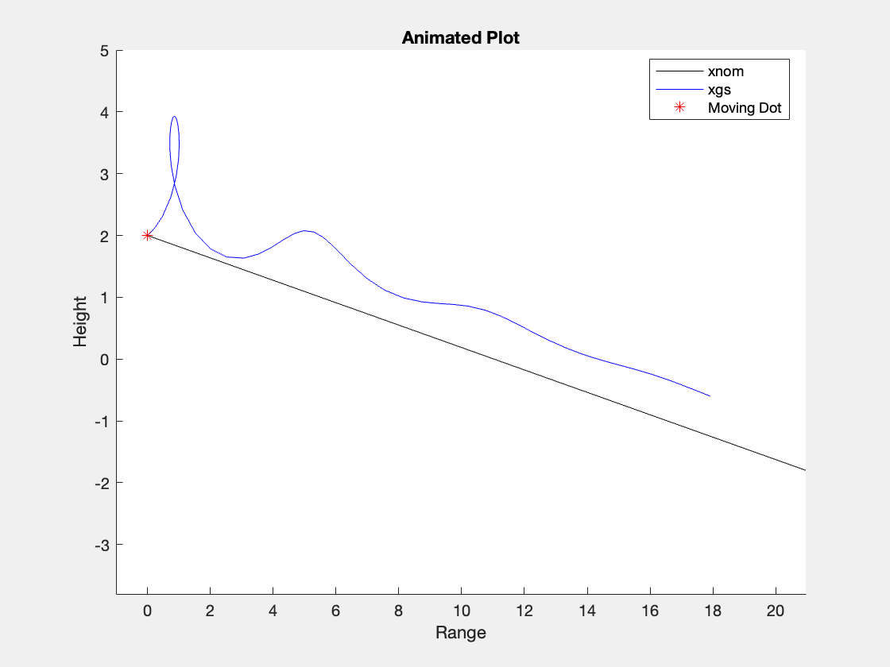

# Paper Airplane Numerical Study
  Final Project: AEM 3103 Spring 2024
  - By: Madhurima Das & Jocelyn Prewett

  ## Summary of Findings
  <Show the variations studied in a table>
The height and range were observed while varying the initial vellocity and flight path angle(Gamma). Afterwards, 100 possible trajectories were plotted and a curve fit was applied which captures the avergae of the 100 trajectories. The first derivative of Range vs time and the first derivative of Height vs time plots imply the change in the range and height over time from the fitted line. 

  Summarized what was accomplished in this study.  Describe 2-4 observations from simulating the flight path.
  Reference the figures below as needed.

  *If the analysis falls short of the goal, this is your chance to explain what was done or what were the barriers.*
 
  # Code Listing:
- [PaperPlane.m](https://github.com/madhurimadas3/AEM3103/blob/af7bd46c4f5ee8da65c25e1c3dd182f89c386a7f/PaperPlane.m)
	- Establishes Starting Variables
- [EqMotion.m](https://github.com/madhurimadas3/AEM3103/blob/827eb4b64bd9fb1772f3257a30072cc2b40c96f3/EqMotion.m)
	- Function for the equations of motions for the airplane
- [PartA.m](https://github.com/madhurimadas3/AEM3103/blob/827eb4b64bd9fb1772f3257a30072cc2b40c96f3/PartA.m)
	- Code for the first set of graphs showing Height vs. Range while varying first initial velocity and then gamma
- [PartB.m](https://github.com/madhurimadas3/AEM3103/blob/827eb4b64bd9fb1772f3257a30072cc2b40c96f3/PartB.m)
	- Code for the second set of graphs showing the variations of velocity and gamma with a (red) curve fit, then showing dR/dt over time and dH/dt over time.
- [Animation.m](https://github.com/madhurimadas3/AEM3103/blob/827eb4b64bd9fb1772f3257a30072cc2b40c96f3/Animation.m)
	- Code to create a GIF of V=7.5 m/s and gamma = 0.4 rad against the nominal line

  # Figures

  ## Fig. 1: Single Parameter Variation

Height vs. Range plots 
1. Height vs Range over varying initial velocities
2. Height vs Range over varying flight path angle(Gamma)

*(The first subplot shows varying initial velocity and the second subplot shows varying flight path angle. In each plot, height and range data were plotted with varying parameter velocity and flight path angle)* 

  ## Fig. 2: Monte Carlo Simulation
 

  Monte Carlo simulation 100 trajectories and polyfit

  *(The plot shows Height vs. Range and this is done by creating 100 trajectories by using random initial velocities and flight path angles. This plot shows all the possibilites of 100 random trajecories over 6 seconds of time. A polynomial fit was applied to have an approximation of the average trajectories. The curve in red is the fitted curve.)*

 ## Fig. 3: Time Derivatives
 
 
 Time-derivative of height and range for the fitted trajectory

 *(The time derivatives are of the fitted curve and shows the change)*

  # Animation
  ## Point-Mass Animation
  
  
  

